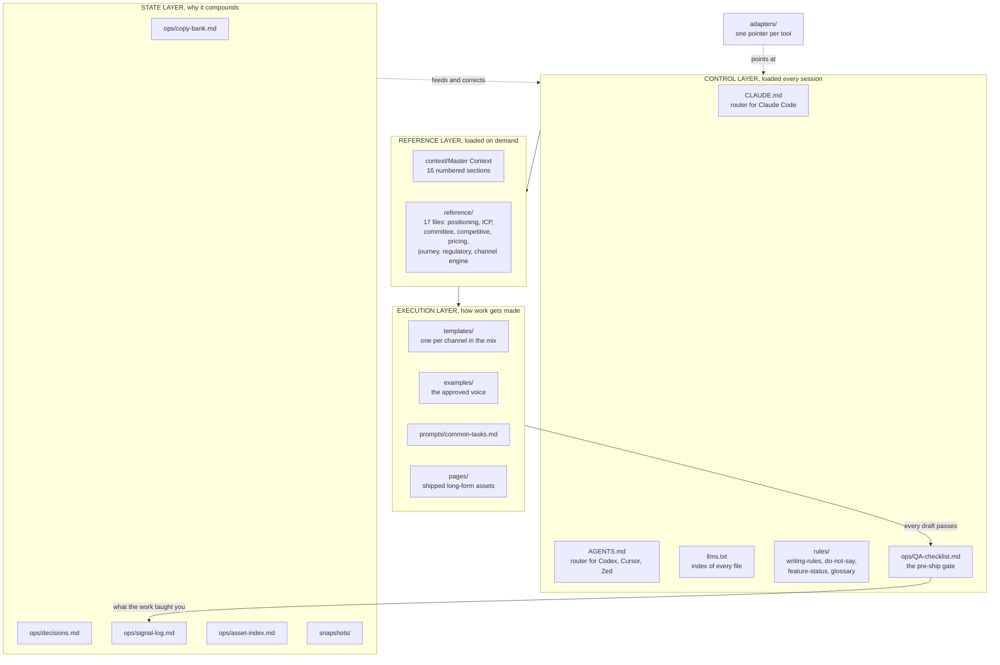
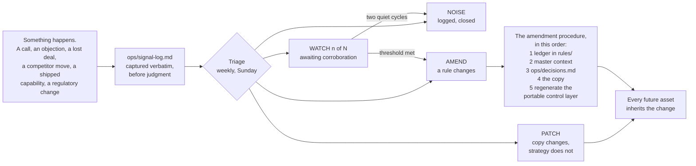
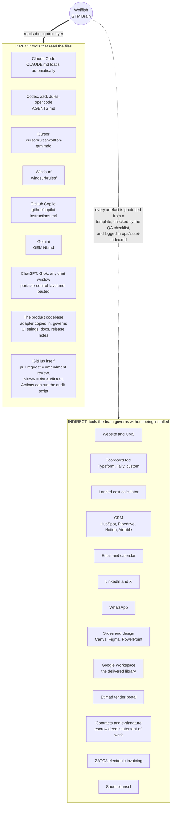

# Wolffish Cloud GTM Brain

The complete go-to-market for **Wolffish Cloud**, held as plain Markdown so that any AI agent or
human operator can load it, execute against it, and be governed by it. This repository is content
and context, not application code.

It exists because a two-person company selling to regulated Saudi enterprises cannot afford to
re-derive its own strategy every time it writes something, and cannot afford an agent that invents
a customer, a certification or a price.

> **Scope.** Kingdom of Saudi Arabia only. Every ICP, price, channel, instrument and claim here is
> scoped to Saudi Arabia. The brain refuses to produce for another market and says why.

---

## What Wolffish Cloud is

Four things at once, and reading it as one of them is the most common error:

| Layer | What it is |
|---|---|
| **A** Agentic harness | Persistent per-employee agents that execute on the employee's own machine: files, shell, multi-step work, under per-role scopes and approval gates |
| **B** Platform control plane | Hard token quota, action-level audit log written to the customer's own store, kill switch, single sign-on, admin scopes, spend visibility |
| **C** Cloud service | Deployment engineering with a pilot cohort, first-class integration into internal and legacy systems, ongoing capability development, a service level, source escrow |
| **D** Saudi regulatory and commercial fit | Saudi registration, riyal contracting, ZATCA electronic invoicing, Arabic contracting, and an architecture where personal data never crosses the border |

It is **not** software with a signup. There is no self-serve motion, no free tier and no trial.
Delivery capacity is **four to six deployments in twelve months** against a named list of about
**twenty accounts**, which is why this go-to-market is built on relationships and events rather
than volume. That is arithmetic, not preference.

---

## The five standing caveats

Every dashboard, document and asset produced from this brain carries these, and so does the brain.

1. **Not software as a service.** Four layers, sold as one. Anything written as a self-serve
   product is wrong at the root.
2. **No self-serve motion.** No trial, no free tier, no signup. The funnel is founder-led.
3. **Two of the three price lines are Wolffish revenue.** The third, inference and infrastructure,
   is billed by the customer's own providers at zero margin and is never described as revenue.
4. **Saudi Arabia only,** for now.
5. **The offer metrics are unreconciled.** The source matrix holds two self-rated blocks describing
   two different companies. The founder block governs, and the conflict is logged as the largest
   repricing risk in the build.

---

## How the brain is shaped

Four layers. The always-loaded layer stays small so that loading it costs nothing; depth is pulled
in on demand.



**The rule that matters most:** one copy of the truth, many doors into it. An adapter never carries
strategy, a claim or a status. It names the load order and stops.

---

## The operating loop, which is what makes this a brain and not a folder



**Ledgers before copy, always.** When status changes, the ledger moves first and copy follows.
Never the other way around, because copy written ahead of a ledger becomes a promise nobody checked.

---

## Where this repository plugs in

Two kinds of connection, and the difference matters.



**Direct** means the tool opens these files. Wire it once and every draft that tool produces is
governed. **Indirect** means the tool never sees the brain, but nothing reaches it that did not
come out of a template and through the checklist. The connection is procedural rather than
technical, and it is the stronger of the two, because it survives a tool change.

Full detail, per tool, with what flows in each direction: **[docs/integration-map.md](docs/integration-map.md)**.

---

## What the founder actually does with it, day by day

```mermaid
flowchart LR
    subgraph DAILY["Daily, minutes"]
        A1["Before any customer-facing<br/>writing: load the router<br/>and the four rules files"]
        A2["After any call: log the<br/>verbatim in the signal log,<br/>same day"]
    end
    subgraph WEEKLY["Weekly, under an hour"]
        B1["Sunday: triage every<br/>new signal, increment<br/>WATCH counters"]
        B2["Write one bilingual post<br/>from templates/founder-post.md"]
    end
    subgraph MONTHLY["Monthly"]
        C1["Ledger sweep: read all four<br/>rules files against reality,<br/>update last_reviewed"]
        C2["Regenerate the portable<br/>control layer if anything moved"]
    end
    subgraph QUARTERLY["Quarterly"]
        D1["Snapshot in snapshots/,<br/>ending in what it changed"]
        D2["Run the audit script,<br/>then produce one live asset<br/>using only the brain"]
        D3["Review the twenty<br/>named accounts"]
    end
    DAILY --> WEEKLY --> MONTHLY --> QUARTERLY
```



Twelve worked use cases, each with the files to load and the time it saves:
**[docs/use-cases.md](docs/use-cases.md)**. The full cycle with owners and staleness thresholds:
**[docs/operating-rhythm.md](docs/operating-rhythm.md)**.

---

## The return

**Speed.** The weekly bilingual post takes twenty minutes instead of two hours, because the
archetype, the anchor fact, the audience and the voice are already decided.

**Consistency across tools and people.** The same guardrails load in Claude Code, in Cursor, in a
chat window and in a contractor's hands. The person on the tool nobody wired up is not careless.
They were never given the rules.

**Defensibility.** Every regulatory claim traces to a named instrument, every capability to a status
flag, and every price to three lines. In a market where the buyer is personally accountable to a
regulator, that is the product of the writing, not a constraint on it.

**Settled strategy stays settled.** Ten dated decisions with their rationale and an explicit note of
what each did not change. A decision reopened six months later by somebody who was not in the room
is the most expensive kind of rework in a two-person company.

**It compounds.** The signal log turns every call into either a sharper ledger or an explicit record
that nothing changed. A style guide goes stale. This gets sharper with use.

**A hire, a contractor or an agency absorbs the whole go-to-market in one read.**

---

## Folder map

| Folder | What it holds | When it is used |
|---|---|---|
| root routers | `CLAUDE.md`, `AGENTS.md`, `llms.txt` | Loaded every session. Traffic control, not content. |
| `context/` | The master context, sixteen numbered sections | Source of truth. Section 15 answers most single-fact lookups. |
| `rules/` | Writing rules, do-not-say, capability status, glossary | The control layer. Checked on every task. |
| `reference/` | 17 files: positioning, ICP, committee, competitive, journey, pricing, regulatory, channel engine, battlecards, objections | Pulled in for content, targeting, pricing and competitive work. |
| `templates/` | One per channel in the mix, and no more | Fill a known structure instead of inventing one. |
| `examples/` | Approved gold-standard output, annotated | The voice reference. Match these. |
| `pages/` | Finished long-form assets | Update rather than rewrite. |
| `prompts/` | Filled, runnable prompts | Fast starts for recurring jobs. |
| `ops/` | Copy bank, decisions, signal log, asset index, QA checklist, review cadence | Living state and the pre-ship gate. |
| `snapshots/` | Dated captures, each ending in what it changed | Evidence that the strategy is holding, or is not. |
| `adapters/` | One pointer per tool, plus the dated portable control layer | Doors for every tool the team runs. |
| `docs/` | Use cases, integration map, diagrams, operating rhythm | For people, not agents. |
| `sources/` | The original dashboards and their extracted text | Where an argument about a claim ends. |

---

## Start here

**If you are an agent:** read `CLAUDE.md`, or `AGENTS.md` if your tool reads that instead. They
name the load order. Do not improvise strategy that is settled in `context/`.

**If you are a person:** read `docs/use-cases.md`, then `context/Wolffish_GTM_Master_Context.md`
Section 15, which is the twenty facts an operator looks up most.

**If you are wiring a tool:** read `adapters/README.md`.

**If you are in a chat window with no file access:** paste `adapters/portable-control-layer.md`.

---

## The maintenance rule

When status changes, update `rules/feature-status.md` and the relevant section of `context/` first,
then let the copy follow. Never the other way around. New market input goes to `ops/signal-log.md`
and is triaged on the cadence in `ops/review-cadence.md`.

Run the audit before any hand-off:

```bash
python3 scripts/audit_brain.py .        # from the GTM Brain skill
```

It checks required files, broken links, index coverage, size budgets, the brain's own writing rules
inside its own prose, unfilled placeholders, ledger staleness, adapter dates, and whether the
compounding loop is actually running.

---

*Built with the Go-to-Market Brain skill. Sources, and the manifest recording what each settles and
where two of them disagreed, are in `sources/`.*
