# Diagrams, maps and flowcharts

The whole go-to-market in pictures. Every diagram here renders natively on GitHub. Nothing in this
file is new information: each one is a view of something written elsewhere in the brain, and the
source file is named underneath it.

Contents: [the product](#1-what-is-being-sold) · [load policy](#2-what-to-load-and-when) ·
[producing an asset](#3-producing-an-asset-end-to-end) · [signal to amendment](#4-signal-to-amendment) ·
[amendment propagation](#5-amendment-propagation-what-changes-when) ·
[the funnel](#6-the-seven-stage-funnel-and-the-channels-that-feed-it) ·
[buying committee](#7-the-buying-committee-sequence) · [the calendar](#8-the-saudi-selling-calendar) ·
[channel mix](#9-channel-mix-and-what-is-refused) · [the wedge](#10-where-wolffish-actually-competes) ·
[refusal logic](#11-should-this-be-produced-at-all)

---

## 1. What is being sold

Four layers, sold as one thing. Reading it as any single layer is the most common error, and the
caveat that opens every deliverable in this go-to-market.

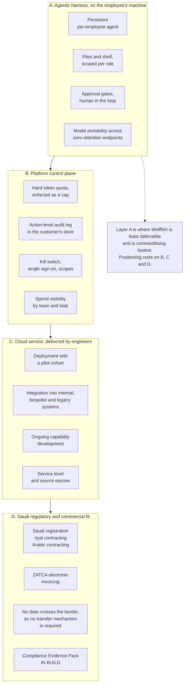

Source: `../reference/feature-matrix.md`, `../rules/feature-status.md`.

---

## 2. What to load, and when

The always-loaded layer stays small. Everything else is pulled in on demand. This is the single
rule that decides whether a brain gets used or quietly abandoned.

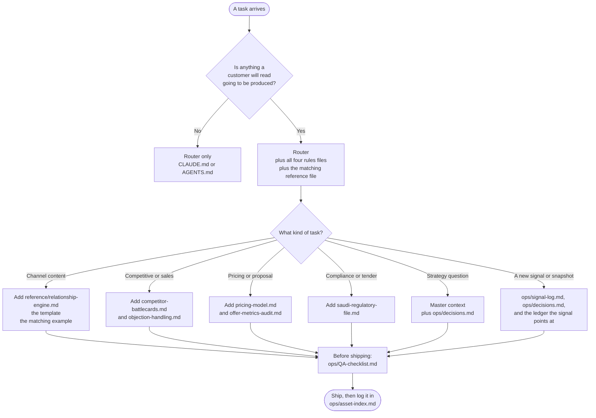

Source: `../llms.txt`, and the load policy in the blueprint.

---

## 3. Producing an asset, end to end

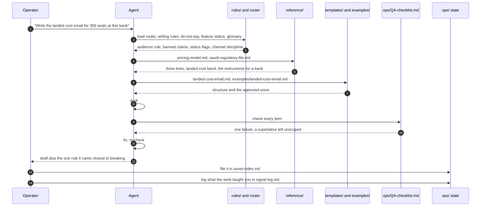

Source: `../ops/QA-checklist.md`, `../prompts/common-tasks.md`.

---

## 4. Signal to amendment

The default disposition is NOISE. A brain that amends on every conversation has no memory. One
that never amends is a static document that quietly stops being true.

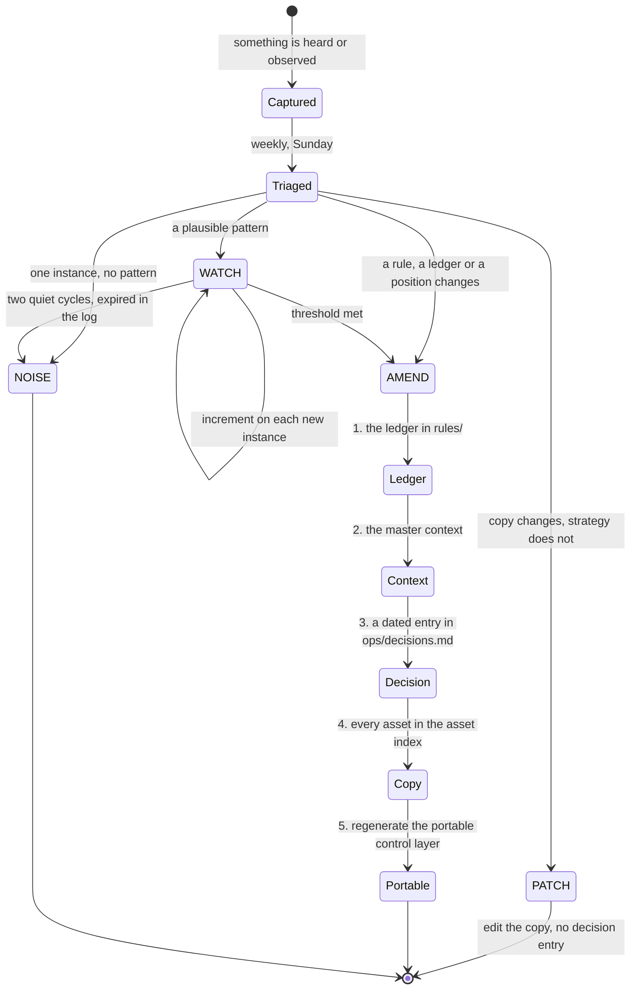

Thresholds: three independent instances in sixty days for an opinion, preference or objection, and
two where the account is on the named list. One verified instance for a fact, a status, a
competitive move or a regulatory change. A full measurement cycle for channel performance, never a
single week.

Source: `../ops/signal-log.md`, `../ops/review-cadence.md`.

---

## 5. Amendment propagation, what changes when

The map an amendment follows. Read it in the direction of the arrows and nothing gets left carrying
an old claim.

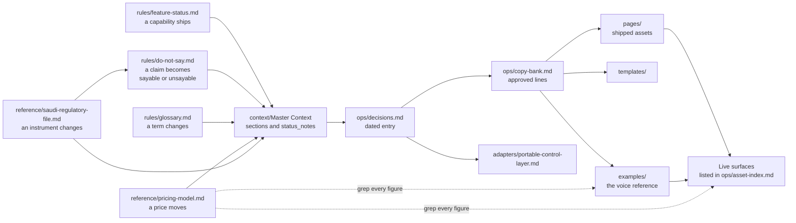

The two files most likely to be forgotten are `examples/`, because an approved example is copied
without a second look, and the portable control layer, because it lives outside every tool that
would have caught it.

Source: `../ops/asset-index.md`.

---

## 6. The seven-stage funnel, and the channels that feed it

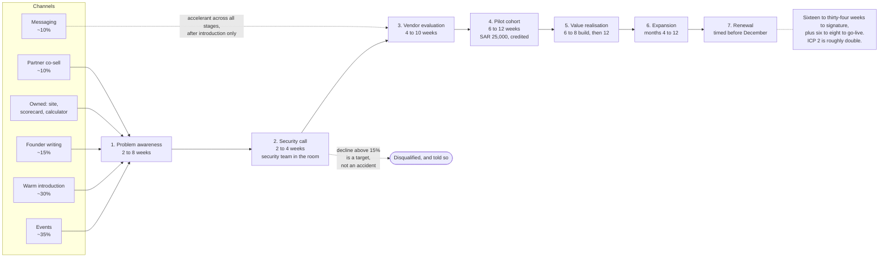

The security call sits at stage two rather than the usual stage three. That single move is the
highest-return process decision in this go-to-market, because in Saudi regulated enterprises the
security officer blocks rather than reviews.

Source: `../reference/customer-journey.md`, `../reference/marketing-campaigns.md`.

---

## 7. The buying committee sequence

Six roles in ICP 1, three more in ICP 2. The order is deliberate and inverts the standard Western
sequence, which starts with the economic buyer and treats security as a late compliance hurdle.

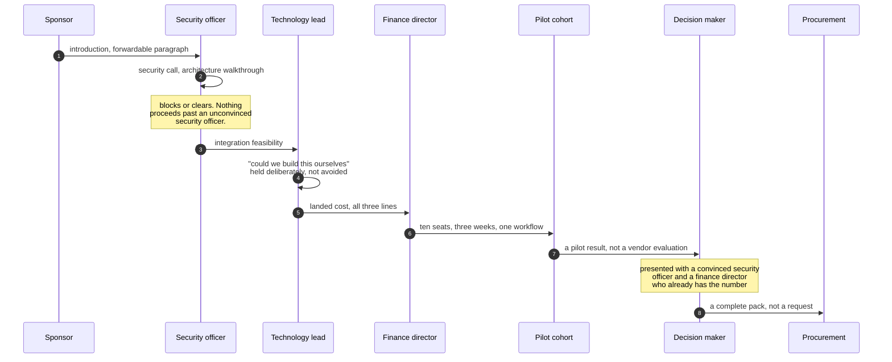

Source: `../reference/buying-committee.md`.

---

## 8. The Saudi selling calendar

Calendar weeks are not selling weeks. This is the fact most often missed, and a plan that assumes
even months is wrong by about forty percent of the year.

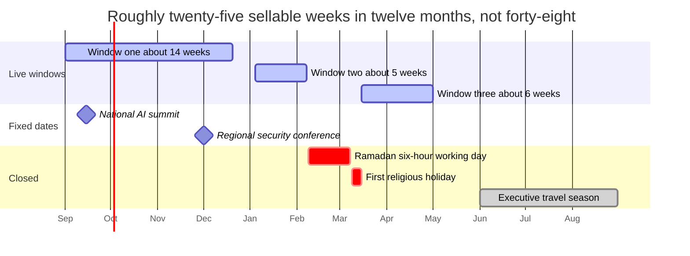

A deal that has not reached stage three by October is a next-year deal and should be managed as
one rather than forecast as this year's.

Source: `../reference/customer-journey.md`.

---

## 9. Channel mix, and what is refused

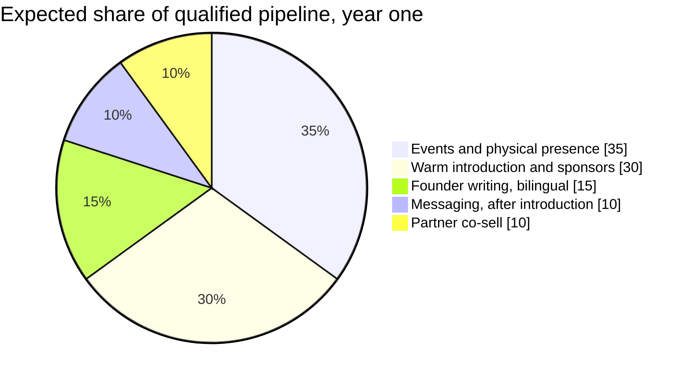

Two channels carry sixty-five percent and neither can be automated. The founder's calendar, not an
advertising budget, is the constraint on this funnel.

Three channels are refused outright rather than deprioritised:

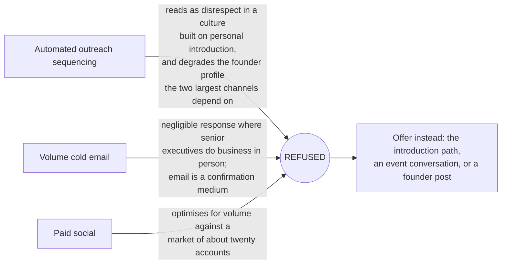

Source: `../reference/relationship-engine.md`, `../reference/marketing-campaigns.md`.

---

## 10. Where Wolffish actually competes

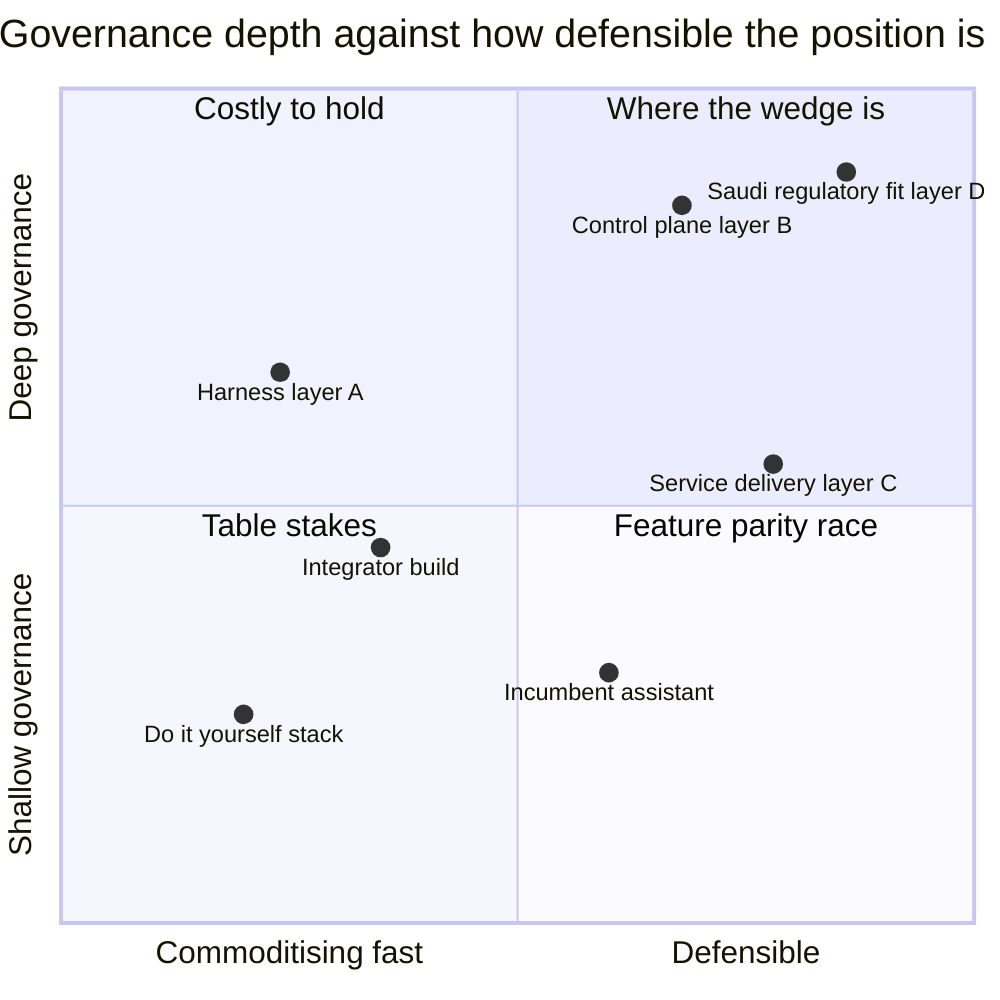

Layer A holds three of the four most negative competitive scores. Any deck built on harness
capability has a twelve-month shelf life. The wedge is layers B and D together, which is why the
security call leads and the feature list does not.

Source: `../reference/competitive-analysis.md`, `../reference/positioning-verdict.md`.

---

## 11. Should this be produced at all?

The refusal logic, as a single decision tree. Most of the value of a control layer is in the
outputs it prevents.

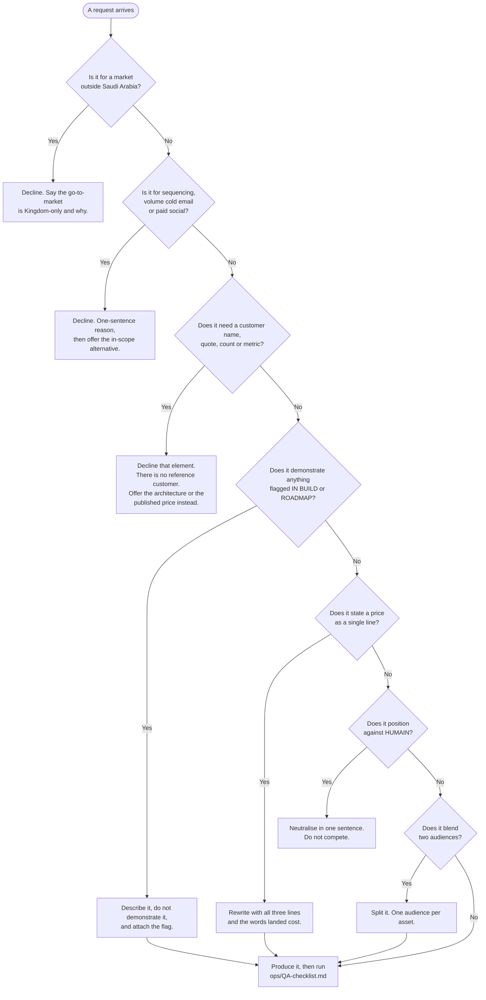

Source: `../CLAUDE.md`, `../rules/do-not-say.md`.
