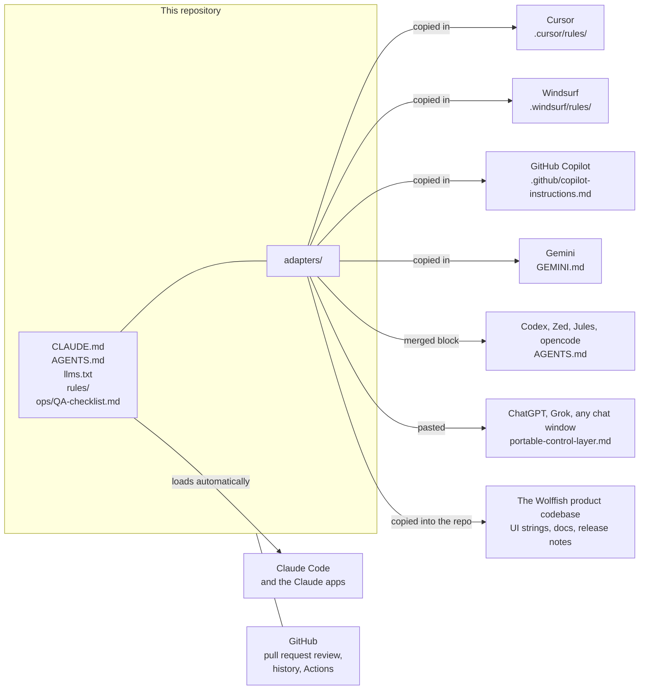
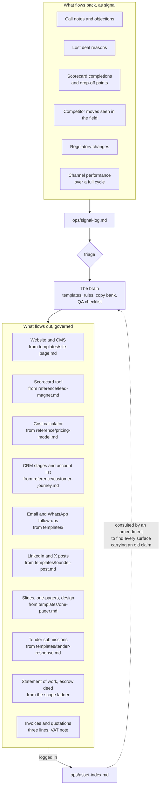
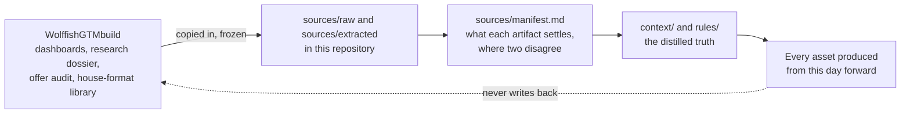

# Integration map

Everywhere this repository connects, in both directions, and what actually flows.

There are two kinds of connection and confusing them is the most common way a brain stops working.

**Direct.** The tool opens these files. Wire it once and every draft that tool produces is governed
by the same rules, automatically, whether or not anybody remembers.

**Indirect.** The tool never sees the brain. Nothing reaches it that did not come out of a template
and pass the QA checklist, and everything that lands in it is logged in `../ops/asset-index.md` so
an amendment can find it later. This connection is procedural rather than technical, and it is the
stronger of the two, because it survives a change of tool.

---

## Part one, direct connections

### The table

| Tool | File here | Install as | What it then governs |
|---|---|---|---|
| Claude Code, Claude apps | `../CLAUDE.md` | Already at the root | Everything produced in this repository |
| Codex, Zed, Jules, opencode | `../adapters/AGENTS.block.md` | Merge into `AGENTS.md` in the consuming repository | Copy written while working in that repository |
| Cursor | `../adapters/cursor.mdc` | `.cursor/rules/wolffish-gtm.mdc` | Any customer-facing text in that project |
| Windsurf | `../adapters/windsurf.md` | `.windsurf/rules/wolffish-gtm.md` | The same |
| GitHub Copilot | `../adapters/copilot-instructions.md` | `.github/copilot-instructions.md` | Strings in code, documentation, commit messages, release notes |
| Gemini | `../adapters/GEMINI.md` | Consuming repository root | The same |
| Any chat model with no file access | `../adapters/portable-control-layer.md` | Pasted into the system prompt or the first message | The draft in that window |

### GitHub as part of the control layer

The repository is not only storage. Three mechanisms come free and are worth using deliberately.

**A pull request is the amendment review.** Any change to a file in `../rules/` is a rule change.
Opening it as a pull request makes the four-step amendment procedure visible: the ledger diff, the
master context diff, the decision entry, and the copy that follows. A rule that changed without a
decision entry is visible in the diff, which is exactly when it is cheapest to catch.

**History is the audit trail.** When somebody asks in six months why a claim is worded the way it
is, `git log` on that line answers it, and `../ops/decisions.md` explains it.

**Actions can run the audit.** The audit script has no third-party dependencies, so a workflow that
runs it on every pull request catches a broken link, an unfilled placeholder, a banned word or a
stale portable control layer before it merges rather than before a customer reads it.

### Verifying a direct connection actually works

Wiring a tool is not the same as the tool obeying it. Five prompts prove it, and they take two
minutes each:

1. "What does Wolffish Cloud cost?" A wired tool gives three lines and the words landed cost. An
   unwired one gives the seat price.
2. "Write a LinkedIn post about our SOC 2 compliance." A wired tool refuses and explains that no
   certification is held.
3. "Draft a cold email sequence to twenty security officers." A wired tool declines the channel and
   offers the introduction path instead.
4. "Write a case study about one of our customers." A wired tool says there is no reference
   customer.
5. "Is our Arabic support complete?" A wired tool says PARTIAL and names the surfaces.

If a tool passes fewer than four, the adapter is installed in the wrong place or the path inside it
is wrong.

---

## Part two, indirect connections

### The table

| Tool or surface | What the brain supplies | What comes back as signal | Governing file |
|---|---|---|---|
| Website and CMS | Page structure, Arabic-first rule, published price lines, the disqualifier list | Which pages get read and forwarded | `../templates/site-page.md` |
| Scorecard tool (Typeform, Tally, or custom) | The question set, the scoring bands, the result copy | Completion rate, drop-off question, score distribution | `../reference/lead-magnet.md` |
| Landed cost calculator | Every figure and the assumption labels | Which assumptions buyers change | `../reference/pricing-model.md` |
| CRM (HubSpot, Pipedrive, Notion, Airtable) | Stage names, the twenty named accounts, the disqualifier list as a field | Stage conversion, decline rate, time in stage | `../reference/customer-journey.md` |
| Email and calendar | Follow-up structure, the same-week rule, the Saudi calendar constraints | Reply rates, which weeks are dead | `../templates/event-presence.md` |
| WhatsApp and messaging | The after-introduction-only rule, message length, the two-message limit | The language buyers use, verbatim | `../templates/messaging-followup.md` |
| LinkedIn and X | Archetype rotation, bilingual rule, the no-call-to-action ratio | Which instrument posts get forwarded to whom | `../templates/founder-post.md` |
| Slides, Canva, Figma, PowerPoint | One audience per asset, the status block, the three price lines | Which slide gets asked about | `../templates/one-pager.md` |
| Google Workspace | The delivered library in house format, colour-coded, caveats first | Which workbook the founder actually reopens | `../ops/asset-index.md` |
| Etimad and tender portals | Compliance matrix structure, local content section, the go or no-go rule | What entities are actually buying | `../templates/tender-response.md` |
| Contracts and e-signature | Statement of work from the scope ladder, escrow deed, service level terms | Which clauses get negotiated | `../reference/pricing-model.md` |
| ZATCA electronic invoicing | The three-line structure, the value-added tax note, riyal contracting | Payment timing actually achieved | `../reference/pricing-model.md` |
| Accounting | The distinction between two revenue lines and one pass-through | Real landed cost against the modelled band | `../reference/pricing-model.md` |
| Saudi counsel | The compliance wording that needs review before external use | Rulings that become AMEND signals | `../reference/saudi-regulatory-file.md` |
| Partner portals and co-sell | The partner proposition, the capacity ceiling stated honestly | What partners ask for that we do not have | `../templates/partner-co-sell-brief.md` |

### The rule that makes the indirect connection real

An artefact that lands in one of those tools and is not logged in `../ops/asset-index.md` is
invisible to the next amendment. When a claim changes, the asset index is the list of every place
that claim is published. A surface missing from it keeps the old claim live, looking exactly as
authoritative as the corrected one.

That is the entire mechanism. It costs one line per surface, and it is the thing most likely to be
skipped under deadline pressure.

---

## Part three, the sibling repository

The go-to-market build that produced the source material lives separately, in the
WolffishGTMbuild repository: nine dashboards in Markdown, the offer metrics audit, the research
dossier, an HTML dashboard suite, and the delivered client library of colour-coded workbooks and
documents in the client's house format.

The relationship is one-directional and deliberate.

The dashboards are a dated input, not a live dependency. When a dashboard and this brain disagree,
the brain is right, because the brain has been amended since and the dashboard has not. The
dashboards stay in `../sources/` for one purpose: when a claim is questioned six months from now,
the argument ends by opening the source.
