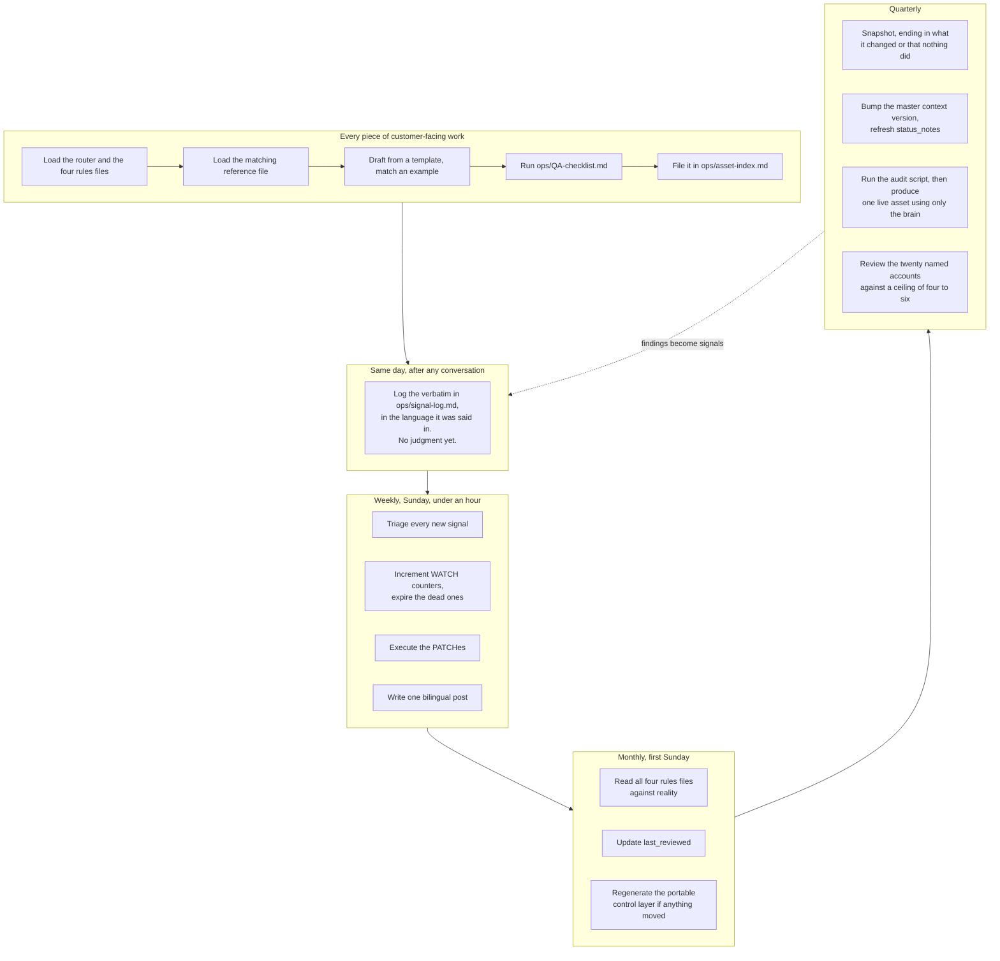

# Operating rhythm

When each part of this brain is touched, by whom, and what breaks if it is skipped.

This is a two-person company, so every owner below is the founder until somebody else exists. That
is not a reason to drop the ritual. It is the reason to keep each one short enough that it actually
happens on a week when three deals are live.

The authoritative version of the table, with the staleness thresholds, is
`../ops/review-cadence.md`. This page explains the reasoning behind it.

---

## The cycle

---

## Same day: capture

**What.** Every call, objection, competitor remark, partner request or regulatory notice goes into
`../ops/signal-log.md` before the day ends. Verbatim, in the language it was said in.

**Why the same day.** The exact phrasing a buyer used before we taught them ours is the most
valuable thing a signal carries, and it is gone by Wednesday. What survives instead is a paraphrase
already translated into house vocabulary, which is worth almost nothing.

**Why no judgment yet.** Capture is cheap on purpose. A signal that has to be debated before it can
be written down does not get written down.

**What breaks if skipped.** The customer language section of `../ops/copy-bank.md` stays empty
forever, and the brain never learns anything the founder did not already believe.

---

## Weekly, Sunday: triage

Sunday is the first working day of the Saudi week, which is why triage sits there rather than on a
Monday.

**What.** Disposition every new signal as NOISE, WATCH, PATCH or AMEND. Increment the WATCH
counters. Expire any WATCH that has not moved in two cycles, and write the expiry into the log.
Execute the PATCHes, which are copy edits and need no decision entry.

**Why the default is NOISE.** A brain that amends on every conversation has no memory and
flip-flops on the last thing it heard, which is worse than a static document because it carries
more authority. The thresholds exist to sit between that and never changing at all.

**The Saudi adjustment.** Three independent instances is a high bar against a named list of about
twenty accounts. Where a signal comes from inside that list, two is enough, and the entry says so.

**Also on Sunday.** One bilingual founder post. The series compounds and cannot be shortcut, which
is why the cadence matters more than any individual post.

---

## Monthly, first Sunday: the ledger sweep

**What.** Read all four files in `../rules/` against what is actually true this month. Update
`last_reviewed` on each. If anything moved, regenerate `../adapters/portable-control-layer.md`,
because it carries content rather than a pointer.

**Why `feature-status.md` is the one that matters.** It goes stale fastest and its staleness does
the most damage, because it is the only thing standing between a roadmap and a promise. A
capability that shipped three weeks ago and is still flagged IN BUILD costs a deal in the
conservative direction. One that slipped and is still flagged SHIPPED costs a relationship.

**Why the regulatory file is second.** The instruments in this market are young and they move. An
adequacy list published under the personal data law would change the central argument of this
entire go-to-market inside a week, which is why a regulatory signal acts on one verified instance
rather than three.

---

## Quarterly: snapshot, audit, accounts

**The snapshot.** A dated capture in `../snapshots/`, following the sections in the baseline:
funnel, channel, segment, wins and losses, competitive, product status, economics. It ends with
what it changed, and "no ledger change this period" is a legitimate and useful ending. A snapshot
that changes nothing is the evidence that the strategy is holding.

**The audit and the live test.** Run the audit script, then produce one real asset using only the
brain and run it through the checklist. If the asset needed a fact the brain could not supply, the
brain is not finished, and that gap is the quarter's most useful finding.

**The account review.** Twenty named accounts against a delivery ceiling of four to six. Who moved,
who left, who was added. This is where a founder discovers that the list has quietly grown to
thirty-five, which means it is no longer a list, it is a funnel, and the whole go-to-market has
drifted back into a shape the capacity cannot serve.

---

## Two numbers that force a strategy change rather than a copy change

**The security call decline rate.** Declining above fifteen percent of security calls is a target,
not an accident. A rate near zero means the disqualifier list is not being used, which means the
pipeline is filling with accounts that cannot buy, which shows up four months later as wasted
principal time.

**Weeks of founder time per deployment.** If the first deployment consumes materially more than the
six to eight week standard scope, the delivery ceiling is lower than four to six, and the named
account list has to shrink before anything else is decided.

Both are watched in `../snapshots/2026-09-04-baseline.md` and both belong in the quarterly capture.

---

## The failure this rhythm exists to prevent

The brain drifts silently. Nothing in it announces that it has gone wrong.

A capability ships and the ledger still says IN BUILD. An instrument changes and the regulatory file
still describes the old one. A price moves and an approved example in `../examples/` still carries
the old figure, which is worse than an ordinary stale file because an approved example is copied
without a second look.

Every asset produced in between inherits the error while looking exactly as authoritative as a
correct one. The rituals above cost about two hours a month. Discovering the drift in front of a
security officer costs the account and, in a market of twenty, some of the others.
